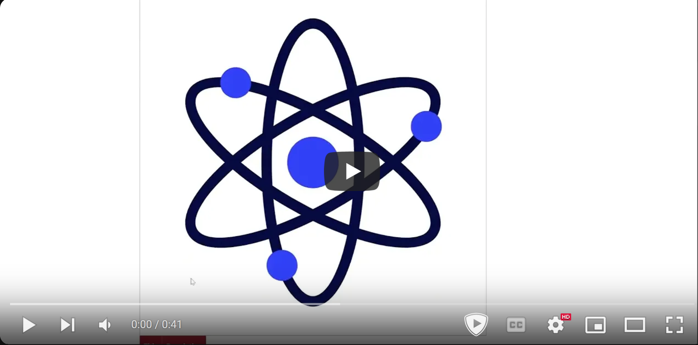

# SVG Image Viewer and Editor

This project is a web-based application that allows users to upload, view, and perform basic edits on SVG (Scalable Vector Graphics) files. It utilizes a Node.js/Express backend, a C library for SVG parsing and manipulation, and a standard HTML/CSS/JavaScript frontend.

**Click the image below to watch the demo on YouTube:**

[](https://youtu.be/6CJAK08mBy0)

## Features

*   **SVG Upload:** Users can upload SVG files via a web interface.
*   **SVG Validation:** Uploaded files are validated against an SVG schema (`svg.xsd`) using the `libxml2` library.
*   **SVG Information Display:** Displays key information about valid SVG files, including:
    *   Filename and file size.
    *   Title and description embedded within the SVG.
    *   Counts of basic shapes (Rectangles, Circles, Paths) and Groups.
    *   Summaries of components and their attributes.
*   **SVG Editing:**
    *   Modify the title and description of an SVG file.
    *   Scale all rectangles or circles within an SVG by a given factor.
    *   Add new rectangles or circles to an SVG file.
*   **Dynamic Frontend:** Uses JavaScript to interact with the backend API for displaying information and triggering actions without full page reloads.
*   **JavaScript Obfuscation:** Frontend JavaScript code (`index.js`) is obfuscated before being sent to the client.

## Technology Stack

*   **Backend:** Node.js, Express.js
*   **Frontend:** HTML, CSS, JavaScript
*   **SVG Parsing/Manipulation:** Custom C library (`libsvgparser.so`) using `libxml2`
*   **Node.js <-> C Interface:** `ffi-napi`
*   **File Uploads:** `express-fileupload`
*   **Development:** `nodemon` for automatic server restarts

## Prerequisites

Before running this project, ensure you have the following installed:

*   **Node.js and npm:** [https://nodejs.org/](https://nodejs.org/)
*   **C Compiler:** GCC is recommended (used in the Makefile).
*   **Make:** Build automation tool.
*   **libxml2 Development Libraries:**
    *   On Debian/Ubuntu: `sudo apt-get update && sudo apt-get install libxml2-dev`
    *   On Fedora/CentOS: `sudo yum install libxml2-devel`
    *   On macOS (with Homebrew): `brew install libxml2` (Ensure headers are findable, potentially needing `export C_INCLUDE_PATH=$(brew --prefix)/include/libxml2:$C_INCLUDE_PATH` or similar adjustments in the Makefile if needed).

## Installation

1.  **Clone the repository (if applicable):**
    ```bash
    git clone <repository-url>
    cd SVG-Maker
    ```
2.  **Install Node.js dependencies:**
    ```bash
    npm install
    ```
3.  **Build the C parser library:**
    Navigate to the `parser` directory and run `make`:
    ```bash
    cd parser
    make
    cd ..
    ```
    This will compile the C code and create the `libsvgparser.so` shared library in the project's root directory.

## Usage

1.  **Run the application:**
    Start the server using the `dev` script defined in `package.json`. You need to provide a port number as a command-line argument.
    ```bash
    npm run dev <port_number>
    # Example:
    npm run dev 3000
    ```
2.  **Access the application:**
    Open your web browser and navigate to `http://localhost:<port_number>` (e.g., `http://localhost:3000`).

3.  **Interact with the application:**
    *   Use the "Upload File" section to select and upload `.svg` files.
    *   The "File Log" table will populate with details of valid uploaded SVGs.
    *   Use the "View Panel" to see detailed information and components of a selected SVG.
    *   Use the "Edit Panel" to modify the title/description, add shapes, or scale existing shapes in a selected SVG.

## File Structure


## API Endpoints (Backend - `app.js`)

*   `GET /`: Serves the main `index.html` page.
*   `GET /style.css`: Serves the CSS stylesheet.
*   `GET /index.js`: Serves the obfuscated frontend JavaScript.
*   `POST /upload`: Handles SVG file uploads. Saves files to the `uploads/` directory.
*   `GET /uploads/:name`: Serves an uploaded SVG file by name.
*   `GET /endpoint2`: Fetches details (metadata, component counts, summaries) for all valid SVG files in the `uploads/` directory.
*   `GET /updateNameDescEndpoint`: Updates the title and description of a specified SVG file. (Requires `fileName`, `name`, `desc` query parameters).
*   `GET /updateRectsScaleEndpoint`: Scales all rectangles in a specified SVG file. (Requires `fileName`, `scale` query parameters).
*   `GET /updatecirclesScaleEndpoint`: Scales all circles in a specified SVG file. (Requires `fileName`, `scale` query parameters).
*   `GET /addRectEndpoint`: Adds a new rectangle to a specified SVG file. (Requires `fileName`, `newX`, `newY`, `newWidth`, `newHeight` query parameters).
*   `GET /addCircEndpoint`: Adds a new circle to a specified SVG file. (Requires `fileName`, `newCX`, `newCY`, `newR` query parameters).

## C Library Functions (`libsvgparser.so`)

The Node.js backend interacts with the following functions exposed by the C library (`libsvgparser.so`) via `ffi-napi`:

*   `isValidSVGFromFile`: Validates an SVG file against a schema.
*   `getFileSize`: Gets the size of a file.
*   `getNumsFromFile`: Gets the counts of rectangles, circles, paths, and groups.
*   `getSVGDescription`: Extracts the description from an SVG file.
*   `getSVGTitle`: Extracts the title from an SVG file.
*   `getRectsImmediateChildrenSummary`: Gets a summary string of rectangle components.
*   `getRectsAttrImmediateChildrenSummary`: Gets a summary string of rectangle attributes.
*   `getCirclesImmediateChildrenSummary`: Gets a summary string of circle components.
*   `getCircsAttrImmediateChildrenSummary`: Gets a summary string of circle attributes.
*   `getPathsImmediateChildrenSummary`: Gets a summary string of path components.
*   `getPathsAttrImmediateChildrenSummary`: Gets a summary string of path attributes.
*   `getGroupsImmediateChildrenSummary`: Gets a summary string of group components.
*   `getGroupsAttrImmediateChildrenSummary`: Gets a summary string of group attributes.
*   `updateSVGNameDesc`: Updates the title and description in an SVG file.
*   `scaleRect`: Scales all rectangles in an SVG file.
*   `scaleCirc`: Scales all circles in an SVG file.
*   `addRect`: Adds a rectangle to an SVG file.
*   `addCirc`: Adds a circle to an SVG file.

## License

This project is licensed under the ISC License - see the `package.json` file for details.
